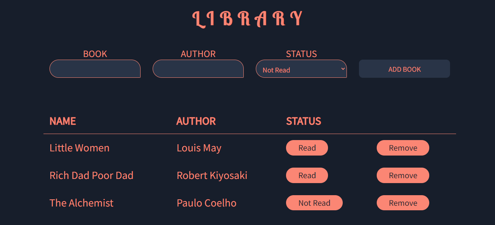

# Library
Library - a personal book managing application made using HTML, CSS and Javascript for The Odin Project

## Features
- Add as many books you want, no limit
- Persistent data storage
- Update book status even after the book is already stored
- Delete a book anytime

## Learnings
- Object: the prototype object. All objects are instances of Object, which has null as its prototype.
- Object Constructors
- Prototype 
- Prototype Chain and Inheritance

## Roadmap
- Take input from the user on the number of pages read
- Sort books according to the status: Read or Not Read
- Display the total number of books read

## Preview

## Demo
👉 [Live Demo](https://ruchita1010.github.io/library)